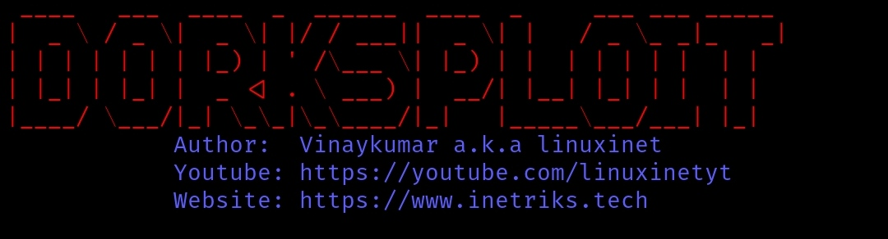

## DORKSPLOIT
**Dorksploit Google Hacking Dork Scraping and Searching Script**

Dorksploit is a script I made in python 3. With this tool, you can easily find Google Dorks. Dorksploit collects potentially vulnerable web pages and applications on the Internet or other awesome info that is picked up by Google's search bots.

***

You can save the output in a file so that you can view it at a later time. You can determine the number of searches yourself. The number of websites to display

You can also use Dorks Eye as a command-line interface (CLI) to quickly search through Google. Dorks Eye shows only the links, without advertising, and is and is also fast.

But be careful not to overdo it, otherwise, you have a chance that If you perform too many requests over a short period, Google will start to throw captchas at you. This is annoying and will limit how much or how fast you do the search.
****

# What data can we find using Google Dorks?

Username and passwords
Admin login pages
Sensitive documents
Govt/military data
Email lists
Bank account details
Vulnerable websites
So much more …
****

****

## Install Dorks Eye
A prerequisite for a script that I make must be that it is simple and easy to use and understand for everyone.

Dorks Eye has tested it so far on:
* Kali Linux
* Ubuntu
* Parrot Security
* BlackArch
* Termux

This list would be expanded
****

Dorksploit is written for Python 3. Clone the git repository and install the requirements.
****

# Linux
sudo git clone https://github.com/Linuxinet/DORKSPLOIT.git

cd dorks-eye

pip3 install -r requirements.txt

# Dorks Eye Usage Linux

sudo python3 dorksploit.py

****

# Termux

git clone https://github.com/Linuxinet/DORKSPLOIT.git

cd DORKSPLOIT

pip install -r requirements.txt

# Usage Termux

python dorksploit.py

****

## I also want to make you aware that:
* This was written for educational purpose and pentest only.
* The author will not be responsible for any damage ..!
* The author of this tool is not responsible for any misuse of the information.
* You will not misuse the information to gain unauthorized access.
* This information shall only be used to expand knowledge and not for
causing malicious or damaging attacks.
* Performing any hacks without written permission is illegal ..!
****

# Contact to coder
Social Networks - Connect

# [Youtube@Linuxinet](https://youtube.com/Linuxinetyt)

***
